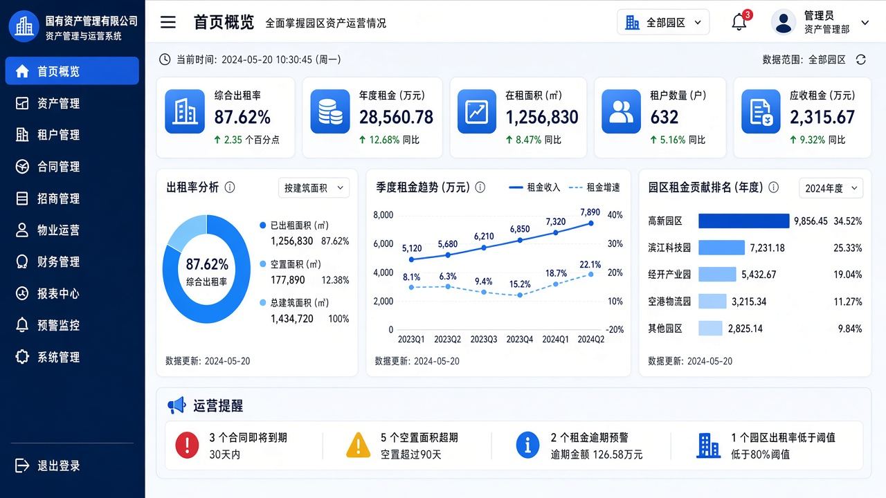

# 绍兴柯桥经济技术开发区控股集团有限公司资产管理及智慧办公系统

> 上线主域名: [https://26-kq-asset-bid.softwarelink.net/](https://26-kq-asset-bid.softwarelink.net/)  
> 项目代码仓库: [https://github.com/softwarelink-net/26-kq-asset-bid](https://github.com/softwarelink-net/26-kq-asset-bid)



---

## 部署与运行说明

### 环境要求
- Node.js >= 18.0.0
- npm >= 9.0.0 或 pnpm >= 8.0.0

### 安装依赖
```bash
npm install
```

### 本地运行
```bash
# 启动前端本地开发服务器 (纯前端运行，自动加载本地 SQLite 数据库文件)
npm run dev
```
启动完成后，在浏览器打开终端输出的本地开发服务器地址（如 `http://localhost:5173/`）即可体验完整系统。

### 演示账号一览
| 角色类型 | 登录账号 | 默认密码 | 角色标识 | 说明 |
| :--- | :--- | :--- | :--- | :--- |
| 系统超管 | `admin` | `Admin@2026` | `ROLE_SUPER_ADMIN` | 集团信息网络总管 / 架构师 |
| 资产主管 | `asset_lead` | `Lead@2026` | `ROLE_ASSET_DIRECTOR` | 资产运营部部长 / 财务主管 |
| 经办管家 | `officer` | `Work@2026` | `ROLE_OFFICE_STAFF` | 园区招商经理 / 资产综合专员 |
| 决策长官 | `leader` | `Leader@2026` | `ROLE_DECISION_MAKER` | 集团分管领导 / 决策长官 |

### 常用脚本一览
- `npm run dev`: 本地启动 Vite 高性能开发服务器
- `npm run build`: 前端生产构建打包并输出到 dist 纯静态目录
- `npm run preview`: 本地预览生产构建产物
- `npm run lint`: 执行代码规范检查与 TypeScript 类型校验
- `npm run screenshot`: 登录控制台并刷新 `docs/assets/dashboard-preview.png`
- `npm run deploy`: 构建并上传至 R2（`allworld-sites/26-kq-asset-bid`）

### 目录结构
```text
26-kq-asset-bid/
├── docs/
│   └── assets/
│       └── dashboard-preview.png
├── scripts/
│   ├── build-sqlite.mjs
│   ├── deploy-allworld.mjs
│   └── screenshot-dashboard.mjs
├── public/
│   ├── data/
│   │   └── kqasset_database.sqlite
│   ├── sitemap.xml
│   └── favicon.ico
├── src/
│   ├── assets/
│   ├── components/
│   │   ├── common/
│   │   │   └── GlobalStickyBanner.vue
│   │   └── layout/
│   ├── layouts/
│   │   ├── AuthLayout.vue
│   │   └── MainLayout.vue
│   ├── router/
│   │   └── index.ts
│   ├── stores/
│   ├── utils/
│   │   └── sqljs-engine.ts
│   ├── views/
│   │   ├── auth/
│   │   ├── dashboard/
│   │   ├── properties/
│   │   ├── contracts/
│   │   ├── workflow-oa/
│   │   ├── arrears-risk/
│   │   └── system/
│   ├── App.vue
│   └── main.ts
├── schema.sql
├── package.json
└── README.md
```

---

## 招标公告全文

### 1. 标题
绍兴柯桥经济技术开发区控股集团有限公司资产管理及智慧办公系统服务采购项目招标公告

### 2. 项目发包方
绍兴柯桥经济技术开发区控股集团有限公司

### 3. 项目编号
绍柯企〔2026〕983号

### 4. 项目发布时间
2026-09-17 10:00:00

### 5. 关键词
绍兴柯桥经开区控股集团, 资产管理系统, 智慧办公系统, 乐采云平台, 绍柯企〔2026〕983号, 浙江国企采购, 国资数字化

### 6. 摘要
绍兴柯桥经济技术开发区控股集团有限公司委托浙江越锋项目管理有限公司，对资产管理及智慧办公系统服务采购项目组织公开招标，预算金额与最高限价为604,000.00元。采购内容为资产管理及智慧办公系统服务1项，不接受联合体投标，采用乐采云平台线上全流程电子化招投标，投标文件递交截止时间为2026年09月29日09:30。

### 7. 技术要点
- **经开区不动产空间台账全生命周期建模与可视化房态管理**：精准纳管厂房、商业与公寓。
- **租赁合同动态阶梯计费、免租期核算与到期多级自动预警**：防止国有资产收益漏收流失。
- **智慧办公 OA 与“三重一大”国资审批强联锁闭环**：保障资产重大调拨程序合规。
- **纯前端 WebAssembly sql.js 边缘极速响应体系**：零服务器常驻运维开销，数据本地极简持久化。

### 8. 技术创新性
- **全要素经开区国有资产经营与履约风险数字孪生驾驶舱**：宏观掌控资产出租率、租金收益现金流与欠费风控指标。
- **统一业务命名空间严格隔离架构**：统一采用专用数据表前缀与独立本地存储载体，杜绝多系统交叉干扰。

---

## 免责声明

1. **数据来源与合规性**：本项目所涉数据信息均采集自互联网公开渠道发布的标讯公示信息。项目开发者严格遵守《中华人民共和国数据安全法》及相关法律法规，确保数据来源合法、公开、可查询。
2. **技术实现路径**：本项目核心内容系基于国产大语言模型进行算法推演与自动化构造生成，非直接引用或复制原始招标文件。
3. **保密承诺**：本项目郑重承诺：不涉及、不包含任何国家秘密、商业秘密或未公开的敏感信息。所有生成内容均基于公开数据的逻辑推演。
4. **知识产权与巧合声明**：鉴于本项目内容均由AI模型基于公开数据推演生成，若生成内容在表述方式、结构逻辑上与任何第三方原始标书文件存在相似之处，纯属技术通用设计之巧合，不构成对任何第三方著作权的侵犯或商业秘密的泄露。本项目不保证生成内容的准确性与完整性，仅供技术研究与学习参考。
5. **免责条款**：任何单位或个人使用本项目代码及生成内容所产生的一切后果，均由使用者自行承担，项目开发者不承担任何法律责任。
